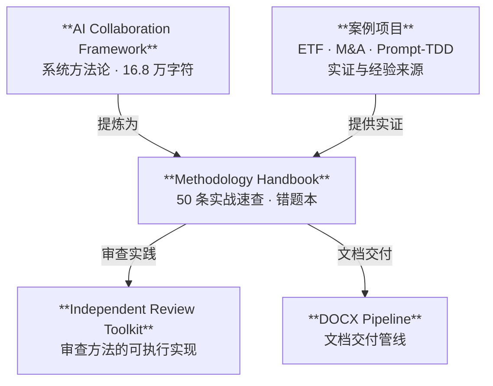

> 简体中文 | [English](en/README.md) | [正體中文](zh-Hant/README.md)

# 方法论与经验教训手册

> 50 条来自真实 AI 协作项目的可检索踩坑实证，覆盖工程纪律、多模型审查、文件与工具陷阱，以及量化研究。

[📖 在线阅读](./方法论与经验教训手册.md) · [📥 下载 PDF/DOCX](../../releases/latest) · [📊 机器可读 JSON](./方法论与经验教训手册.json) · [📝 如何引用](#如何引用)

[](../../releases/latest)
[](https://creativecommons.org/licenses/by/4.0/)

> **适合查阅，不要求通读。** 遇到代码审查、项目发布、配置错误或文档生成问题时，按场景直接跳到对应条目。

**代表性条目：**
- 修改配置后，验证系统实际读取的是哪一个文件——而非猜测（§3.5）
- 同一 AI 不应同时担任设计者、执行者、验证者和评分官（§2.2）
- 发布前检查 `.gitignore` 排除的文件，而非仅检查已跟踪的文件（§1.2）



---

## Methodology & Lessons Learned Handbook

**A compact, battle-tested companion to the AI Collaboration Full-Lifecycle Framework — 50 empirically-grounded lessons.**

Version 1.0.1 | 2026-07-20

> The relationship to the full framework (168K characters) is like "textbook" vs. "error logbook": the framework is the systematic methodology; this handbook distills the mistakes into quick-reference entries. Source material comes from the author's personal project notes, curated and published here.

---

## 快速导航

- [开始使用](#使用方式--how-to-use)
- [按问题场景查找](#使用方式--how-to-use)
- [章节概览](#目录--contents)
- [代表性条目](#分类标签索引--category-tag-index)
- [格式与下载](#格式--format)
- [证据范围与限制](#受众与前置--audience--prerequisites)
- [如何引用](#如何引用)
- [相关项目](#相关项目--related-projects)
- [许可](#许可--license)

---

## 目录 / Contents

| 章节 | 条目数 | 内容 |
|------|--------|------|
| §1 通用工程纪律 | 9 | 验证与核实、清理与发布、版本管理、代码重构 |
| §2 AI 协作方法论 | 32 | 多模型审查、provenance、prompt 设计、工作流、认知偏差 |
| §3 文件格式与工具陷阱 | 6 | YAML/JSON、DOCX、文本编辑、编码、配置文件 |
| §4 量化研究专项 | 3 | 特征泄漏、LambdaRank、regime 检测 |

每条含：**标题** + 一句话教训 + 关键引述 + 实证日期 + 分类标签。

---

## 分类标签索引 / Category Tag Index

<details>
<summary>展开完整分类标签索引（22 个标签）</summary>

| 标签 | 含义 | 条目数 |
|------|------|--------|
| 验证纪律 | 下断言/改配置/改措辞后的独立验证 | 3 |
| 发布纪律 | 发布前的清理、排除、零残留确认 | 3 |
| 版本管理 | 版本号升级的同步范围 | 1 |
| 代码重构 | 从单体提取模块的方法 | 1 |
| 工具使用 | 给外部 CLI 工具发指令的约定 | 1 |
| 多模型审查 | 多个 AI 模型做代码/文档审查的策略 | 9 |
| provenance | 产出物的模型来源追溯 | 3 |
| 独立性审查 | 防止同一 AI 占据多重角色的检查 | 1 |
| 工具评估 | 评估 AI 代理工具的实证方法 | 2 |
| 实验设计 | prompt 变异 vs 模型变异的效应量 | 1 |
| 任务执行 | 有计划时的执行纪律、文本生成流程 | 2 |
| 交付物设计 | md/json 双件的配对模式 | 1 |
| prompt 设计 | CLAUDE.md 编写、Skill 设计协议 | 2 |
| 工作流 | 任务分派、交叉验证、过程文件保存 | 3 |
| 上下文管理 | 大上下文压缩的触发时机 | 2 |
| 认知偏差 | 自评估偏乐观、实证声明过推广、格式残留盲区 | 3 |
| 协作元认知 | 对抗式审查、被动观测、失败重试策略 | 3 |
| 文件格式 | YAML/JSON/CFF/DOCX 格式陷阱 | 3 |
| 文本编辑 | 短模式全局替换的误伤风险 | 1 |
| 编码 | Windows 终端中文字符编码 | 1 |
| 配置 | 修改配置前确认系统读取的文件 | 1 |
| 量化研究 | 特征泄漏、LambdaRank 敏感性、regime 滞后 | 3 |

</details>

---

## 术语说明 / Glossary

手册中涉及特定工具或工作流概念。关注条目中的**通用原则**即可——原则独立于具体 CLI 实现。

| 术语 | 定义 | 来源 |
|------|------|------|
| Workflow | 多 agent 编排框架，支持并行/管道式子任务分发 | Claude Code CLI |
| agent() | Workflow 中启动子 agent 的函数 | Claude Code CLI |
| headroom_compress | 将大文本预压缩以节省上下文窗口 | Claude Code CLI (MCP) |
| 安全分类器 / classifier | 执行命令前的安全审核组件 | Claude Code CLI |
| Codex CLI | OpenAI 命令行 AI 编程工具 | Codex CLI |
| [GATE] | 计划中标记为需人工确认的阻断点 | 项目计划约定 |
| P0/P1/P2 | 优先级：阻塞/高/中 | 通用项目管理 |
| zero-involvement | 零卷入——审查者未参与被审查内容的创建 | 审查方法论 |
| provenance | 产出物的模型后端×会话溯源记录 | AI 协作通用 |

完整术语表见手册附录。

---

## 受众与前置 / Audience & Prerequisites

**目标读者**：使用 AI 编程工具（Claude Code、Codex CLI、Cursor 等）进行软件工程或学术项目的开发者与研究者。假设读者有基本的 AI 辅助编程经验。

**证据范围**：手册中的"实证"指作者在 2026 年 5-7 月间多次 AI 协作项目中记录的具体事件。数字（如"7/7 收敛""~11% 偏差"）来自单次观测，适用范围限于当时使用的模型版本和任务类型。应视为**案例参考**而非统计结论。

手册为 md/json 双件发布。md 是真相源（先于 json 生成）。

---

## 使用方式 / How to Use

**查阅而非通读。** 这不是教程——是速查手册。遇到具体场景时按分类标签定位：

- [要做代码审查 → §2.1 多模型审查策略](./方法论与经验教训手册.md#21-多模型审查策略)
- [要发布项目 → §1.2 清理与发布](./方法论与经验教训手册.md#12-清理与发布)
- [配置出了问题 → §3.5 配置文件](./方法论与经验教训手册.md#35-配置文件)

**Browse, don't read.** This is a reference, not a tutorial. Navigate by category tags when facing specific situations.

---

## 格式 / Format

- [📖 在线阅读 Markdown](./方法论与经验教训手册.md) — 人类可读（含目录、锚点链接、术语附录）
- [📊 机器可读 JSON](./方法论与经验教训手册.json) — 结构化数据（`metadata` → `sections[]` → `subsections[]` → `entries[]`）
- [English handbook](./en/方法论与经验教训手册.md) — 美式英语翻译（GPT-5.6-Sol 翻译）
- [正體中文手冊](./zh-Hant/方法论与经验教训手册.md) — 正體中文（OpenCC 转换 + GPT-5.6-Sol 校对）
- [📥 下载 PDF/DOCX](../../releases/latest) — Release 页面提供最新版本

---

## 相关项目 | Related Projects

| 项目 | 角色 | 何时使用 |
|------|------|---------|
| [**AI 协作项目全生命周期框架**](https://github.com/redamancy231-create/ai-collaboration-framework) | 上游系统方法论 | 需要完整生命周期设计和方法论背景时 |
| [**Independent Review Toolkit**](https://github.com/redamancy231-create/independent-review-toolkit) | 审查方法的可执行实现 | 需要实施独立审查、魔鬼代言人挑战时 |
| [**Prompt-TDD Methodology**](https://github.com/redamancy231-create/prompt-tdd-methodology) | 实验方法论案例 | 需要设计对照实验、证据标注时 |
| [**DOCX Pipeline**](https://github.com/redamancy231-create/docx-pipeline) | 文档交付管线 | 需要生成和验证 Markdown → DOCX/PDF 时 |
| [**claude-skills**](https://github.com/redamancy231-create/claude-skills) | Skill 设计参考 | 需要创建或审查 Claude Code Skill 时 |
| [**ETF Pattern Match (pybind11)**](https://github.com/redamancy231-create/etf-pattern-match-pybind11) | 实证案例 | 需要 Python/C++ 混合编程或多轮审查协议参考时 |
| [**M&A Case Study Pipeline**](https://github.com/redamancy231-create/ma-case-study-pipeline) | 实证案例 | 需要多阶段学术流水线参考时 |

---

## 如何引用

**普通文本引用：**

> Acerolaorion. *方法论与经验教训手册（Methodology & Lessons Learned Handbook）*. Version 1.0.1, 2026-07-20. CC BY 4.0.

**BibTeX:**

```bibtex
@manual{methodology-handbook,
  author       = {Acerolaorion},
  title        = {方法论与经验教训手册（Methodology \& Lessons Learned Handbook）},
  version      = {1.0.1},
  year         = {2026},
  month        = jul,
  url          = {https://github.com/redamancy231-create/methodology-handbook},
  note         = {CC BY 4.0}
}
```

也可引用 [`CITATION.cff`](./CITATION.cff)。如果修改或翻译，请注明变更。

---

## 许可 / License

[CC-BY-4.0](https://creativecommons.org/licenses/by/4.0/)

---

## 作者 / Author

[Acerolaorion](https://github.com/redamancy231-create)
