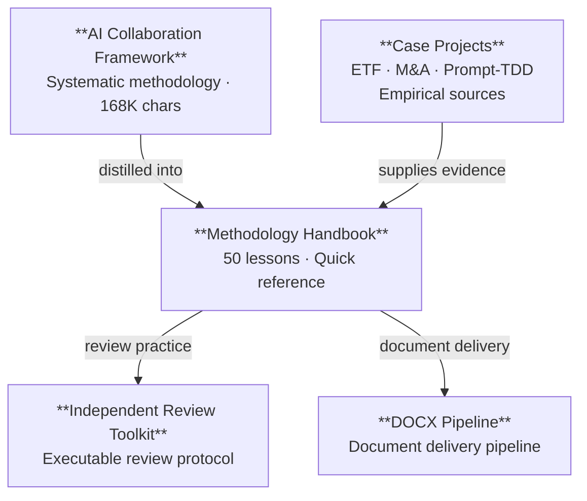

> [中文版本](../README.md) | English | [正體中文](../zh-Hant/README.md)

# Methodology & Lessons Learned Handbook

> 50 searchable, empirically-grounded lessons from real AI collaboration projects — covering engineering discipline, multi-model review, file and tool pitfalls, and quantitative research.

[📖 Read Online](./方法论与经验教训手册.md) · [📥 Download PDF/DOCX](../../releases/latest) · [📊 Machine-Readable JSON](./方法论与经验教训手册.json) · [📝 How to Cite](#how-to-cite)

[](../../releases/latest)
[](https://creativecommons.org/licenses/by/4.0/)

> **Browse, don't read.** When you encounter code reviews, project releases, configuration issues, or document-generation problems, jump directly to the relevant entry by scenario.

**Representative lessons:**
- After changing a configuration, verify which file the system actually reads — don't guess (§3.5)
- The same AI should not serve as designer, executor, verifier, and grader simultaneously (§2.2)
- Before release, inspect files excluded by `.gitignore`, not just tracked files (§1.2)



---

## Quick Navigation

- [Getting Started](#how-to-use)
- [Find by Scenario](#how-to-use)
- [Chapter Overview](#contents)
- [Representative Entries](#category-tag-index)
- [Formats & Downloads](#format)
- [Evidence Scope & Limitations](#audience--prerequisites)
- [How to Cite](#how-to-cite)
- [Related Projects](#related-projects)
- [License](#license)

---

## Contents

| Section | Entries | Coverage |
|---------|---------|----------|
| §1 Engineering Discipline | 9 | Verification and validation, cleanup and release, version management, code refactoring |
| §2 AI Collaboration Methodology | 32 | Multi-model review, provenance, prompt design, Workflow, cognitive biases |
| §3 File Formats and Tool Pitfalls | 6 | YAML/JSON, DOCX, text editing, encoding, configuration files |
| §4 Quantitative Research | 3 | Feature leakage, LambdaRank, regime detection |

Each entry contains a **title**, a one-sentence lesson, a key quote, an empirical date, and a category tag.

---

## Category Tag Index

<details>
<summary>Expand full category tag index (22 tags)</summary>

| Tag | Meaning | Entries |
|-----|---------|---------|
| Verification Discipline | Independent verification after making claims or changing configurations or wording | 3 |
| Release Discipline | Cleanup, exclusion, and zero-residue confirmation before release | 3 |
| Version Management | The full synchronization scope of a version-number update | 1 |
| Code Refactoring | Methods for extracting modules from a monolith | 1 |
| Tool Usage | Conventions for sending instructions to external CLI tools | 1 |
| Multi-Model Review | Strategies for using multiple AI models to review code or documents | 9 |
| provenance | Tracing deliverables back to their source models | 3 |
| Independence Review | Preventing the same AI from occupying multiple roles | 1 |
| Tool Evaluation | Empirical methods for evaluating AI agent tools | 2 |
| Experimental Design | Effect sizes of prompt variation versus model variation | 1 |
| Task Execution | Execution discipline when following a plan and workflows for text generation | 2 |
| Deliverable Design | Pairing patterns for md/json deliverables | 1 |
| Prompt Design | Writing CLAUDE.md and designing Skills | 2 |
| Workflow | Task routing, cross-validation, and preservation of process files | 3 |
| Context Management | When to trigger large-context compression | 2 |
| Cognitive Bias | Optimistic self-assessment, overgeneralized empirical claims, and blind spots involving formatting residue | 3 |
| Collaboration Metacognition | Adversarial review, passive observation, and retry strategies after failures | 3 |
| File Formats | YAML/JSON/CFF/DOCX format pitfalls | 3 |
| Text Editing | Collateral damage from global replacement of short patterns | 1 |
| Encoding | Chinese character encoding in Windows terminals | 1 |
| Configuration | Confirming which configuration file the system actually reads | 1 |
| Quantitative Research | Feature leakage, LambdaRank sensitivity, and regime lag | 3 |

</details>

---

## Glossary

The handbook refers to several specific tools and Workflow concepts. Focus on the **general principles** in each entry — the principles do not depend on any particular CLI implementation.

| Term | Definition | Origin |
|------|------------|--------|
| Workflow | A multi-agent orchestration framework supporting parallel and pipeline-based subtask distribution | Claude Code CLI |
| agent() | The function used to start a sub-agent in Workflow | Claude Code CLI |
| headroom_compress | A tool that precompresses large amounts of text to conserve the context window | Claude Code CLI (MCP) |
| Safety classifier / classifier | A component that performs a safety review before commands are executed | Claude Code CLI |
| Codex CLI | OpenAI's command-line AI programming tool | Codex CLI |
| [GATE] | A blocking point in a plan that requires human confirmation | Project planning convention |
| P0/P1/P2 | Priority levels: blocking/high/medium | General project management |
| zero-involvement | A reviewer did not participate in creating the material under review | Review methodology |
| provenance | A record tracing a deliverable to its model backend × session | General AI collaboration |

See the handbook appendix for the complete glossary.

---

## Audience & Prerequisites

**Target audience:** Developers and researchers who use AI programming tools such as Claude Code, Codex CLI, and Cursor for software engineering or academic projects. Basic experience with AI-assisted programming is assumed.

**Scope of evidence:** "Empirical" in this handbook refers to specific incidents recorded by the author across multiple AI collaboration projects between May and July 2026. Numbers such as "7/7 convergence" and "~11% bias" come from individual observations. Their applicability is limited to the model versions and task types used at the time. They should be treated as **case references**, not statistical conclusions.

The handbook is published as an md/json pair. The md file is the source of truth and is generated before the json file.

---

## How to Use

**Browse, don't read.** This is a reference handbook, not a tutorial. Navigate by category tag when you encounter a specific situation:

- [Preparing a code review → §2.1 Multi-Model Review Strategies](./方法论与经验教训手册.md#21-多模型审查策略)
- [Preparing a project for release → §1.2 Cleanup and Release](./方法论与经验教训手册.md#12-清理与发布)
- [Troubleshooting configuration → §3.5 Configuration Files](./方法论与经验教训手册.md#35-配置文件)

---

## Format

- [📖 Read Markdown online](./方法论与经验教训手册.md) — Human-readable format, including the table of contents, anchor links, and glossary appendix
- [📊 Machine-readable JSON](./方法论与经验教训手册.json) — Structured data organized as `metadata` → `sections[]` → `subsections[]` → `entries[]`
- [English handbook](./en/方法论与经验教训手册.md) — American English translation (GPT-5.6-Sol)
- [正體中文手冊](./zh-Hant/方法论与经验教训手册.md) — Traditional Chinese (OpenCC conversion + GPT-5.6-Sol proofread)
- [📥 Download PDF/DOCX](../../releases/latest) — Latest versions on the Releases page

---

## Related Projects

| Project | Role | When to Use |
|---------|------|------------|
| [**AI Collaboration Framework**](https://github.com/redamancy231-create/ai-collaboration-framework) | Upstream methodology | When you need full lifecycle design and methodological background |
| [**Independent Review Toolkit**](https://github.com/redamancy231-create/independent-review-toolkit) | Executable review protocol | When you need to conduct independent reviews or adversarial challenges |
| [**Prompt-TDD Methodology**](https://github.com/redamancy231-create/prompt-tdd-methodology) | Experimental methodology cases | When you need to design controlled experiments with evidence grading |
| [**DOCX Pipeline**](https://github.com/redamancy231-create/docx-pipeline) | Document delivery pipeline | When you need to generate and validate Markdown → DOCX/PDF |
| [**claude-skills**](https://github.com/redamancy231-create/claude-skills) | Skill design reference | When you need to create or review Claude Code Skills |
| [**ETF Pattern Match (pybind11)**](https://github.com/redamancy231-create/etf-pattern-match-pybind11) | Empirical case | When you need Python/C++ hybrid or multi-round review protocol reference |
| [**M&A Case Study Pipeline**](https://github.com/redamancy231-create/ma-case-study-pipeline) | Empirical case | When you need a multi-phase academic pipeline reference |

---

## How to Cite

**Plain text citation:**

> Acerolaorion. *Methodology & Lessons Learned Handbook*. Version 1.0.1, 2026-07-20. CC BY 4.0.

**BibTeX:**

```bibtex
@manual{methodology-handbook,
  author       = {Acerolaorion},
  title        = {Methodology \& Lessons Learned Handbook},
  version      = {1.0.1},
  year         = {2026},
  month        = jul,
  url          = {https://github.com/redamancy231-create/methodology-handbook},
  note         = {CC BY 4.0}
}
```

You may also cite via [`CITATION.cff`](../CITATION.cff). If you modify or translate, please state your changes.

---

## License

[CC-BY-4.0](https://creativecommons.org/licenses/by/4.0/)

---

## Author

[Acerolaorion](https://github.com/redamancy231-create)
