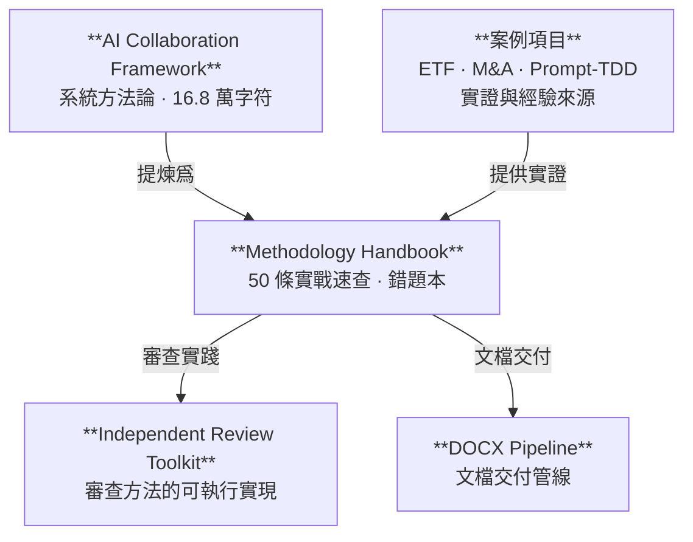

> [簡體中文](../README.md) | [English](../en/README.md) | 正體中文

# 方法論與經驗教訓手冊

> 50 條來自真實 AI 協作項目的可檢索踩坑實證，覆蓋工程紀律、多模型審查、文件與工具陷阱，以及量化研究。

[📖 線上閱讀](./方法论与经验教训手册.md) · [📥 下載 PDF/DOCX](../../releases/latest) · [📊 機器可讀 JSON](./方法论与经验教训手册.json) · [📝 如何引用](#如何引用)

[](../../releases/latest)
[](https://creativecommons.org/licenses/by/4.0/)

> **適合查閱，不要求通讀。** 遇到代碼審查、項目發佈、配置錯誤或文檔生成問題時，按場景直接跳到對應條目。

**代表性條目：**
- 修改配置後，驗證系統實際讀取的是哪一個文件——而非猜測（§3.5）
- 同一 AI 不應同時擔任設計者、執行者、驗證者和評分官（§2.2）
- 發佈前檢查 `.gitignore` 排除的文件，而非僅檢查已追蹤的文件（§1.2）



---

## Methodology & Lessons Learned Handbook

**A compact, battle-tested companion to the AI Collaboration Full-Lifecycle Framework — 50 empirically-grounded lessons.**

Version 1.0.1 | 2026-07-20

> The relationship to the full framework (168K characters) is like "textbook" vs. "error logbook": the framework is the systematic methodology; this handbook distills the mistakes into quick-reference entries. Source material comes from the author's personal project notes, curated and published here.

---

## 快速導航

- [開始使用](#使用方式--how-to-use)
- [按問題場景查找](#使用方式--how-to-use)
- [章節概覽](#目錄--contents)
- [代表性條目](#分類標籤索引--category-tag-index)
- [格式與下載](#格式--format)
- [證據範圍與限制](#受衆與前置--audience--prerequisites)
- [如何引用](#如何引用)
- [相關項目](#相關項目--related-projects)
- [許可](#許可--license)

---

## 目錄 / Contents

| 章節 | 條目數 | 內容 |
|------|--------|------|
| §1 通用工程紀律 | 9 | 驗證與覈實、清理與發佈、版本管理、代碼重構 |
| §2 AI 協作方法論 | 32 | 多模型審查、provenance、prompt 設計、工作流、認知偏差 |
| §3 文件格式與工具陷阱 | 6 | YAML/JSON、DOCX、文本編輯、編碼、配置文件 |
| §4 量化研究專項 | 3 | 特徵泄漏、LambdaRank、regime 檢測 |

每條含：**標題** + 一句話教訓 + 關鍵引述 + 實證日期 + 分類標籤。

---

## 分類標籤索引 / Category Tag Index

<details>
<summary>展開完整分類標籤索引（22 個標籤）</summary>

| 標籤 | 含義 | 條目數 |
|------|------|--------|
| 驗證紀律 | 下斷言/改配置/改措辭後的獨立驗證 | 3 |
| 發佈紀律 | 發佈前的清理、排除、零殘留確認 | 3 |
| 版本管理 | 版本號升級的同步範圍 | 1 |
| 代碼重構 | 從單體提取模塊的方法 | 1 |
| 工具使用 | 給外部 CLI 工具發指令的約定 | 1 |
| 多模型審查 | 多個 AI 模型做代碼/文檔審查的策略 | 9 |
| provenance | 產出物的模型來源追溯 | 3 |
| 獨立性審查 | 防止同一 AI 佔據多重角色的檢查 | 1 |
| 工具評估 | 評估 AI 代理工具的實證方法 | 2 |
| 實驗設計 | prompt 變異 vs 模型變異的效應量 | 1 |
| 任務執行 | 有計劃時的執行紀律、文本生成流程 | 2 |
| 交付物設計 | md/json 雙件的配對模式 | 1 |
| prompt 設計 | CLAUDE.md 編寫、Skill 設計協議 | 2 |
| 工作流 | 任務分派、交叉驗證、過程文件保存 | 3 |
| 上下文管理 | 大上下文壓縮的觸發時機 | 2 |
| 認知偏差 | 自評估偏樂觀、實證聲明過推廣、格式殘留盲區 | 3 |
| 協作元認知 | 對抗式審查、被動觀測、失敗重試策略 | 3 |
| 文件格式 | YAML/JSON/CFF/DOCX 格式陷阱 | 3 |
| 文本編輯 | 短模式全局替換的誤傷風險 | 1 |
| 編碼 | Windows 終端中文字符編碼 | 1 |
| 配置 | 修改配置前確認系統讀取的文件 | 1 |
| 量化研究 | 特徵泄漏、LambdaRank 敏感性、regime 滯後 | 3 |

</details>

---

## 術語說明 / Glossary

手冊中涉及特定工具或工作流概念。關注條目中的**通用原則**即可——原則獨立於具體 CLI 實現。

| 術語 | 定義 | 來源 |
|------|------|------|
| Workflow | 多 agent 編排框架，支持並行/管道式子任務分發 | Claude Code CLI |
| agent() | Workflow 中啓動子 agent 的函數 | Claude Code CLI |
| headroom_compress | 將大文本預壓縮以節省上下文窗口 | Claude Code CLI (MCP) |
| 安全分類器 / classifier | 執行命令前的安全審覈組件 | Claude Code CLI |
| Codex CLI | OpenAI 命令行 AI 編程工具 | Codex CLI |
| [GATE] | 計劃中標記爲需人工確認的阻斷點 | 項目計劃約定 |
| P0/P1/P2 | 優先級：阻塞/高/中 | 通用項目管理 |
| zero-involvement | 零捲入——審查者未參與被審查內容的創建 | 審查方法論 |
| provenance | 產出物的模型後端×會話溯源記錄 | AI 協作通用 |

完整術語表見手冊附錄。

---

## 受衆與前置 / Audience & Prerequisites

**目標讀者**：使用 AI 編程工具（Claude Code、Codex CLI、Cursor 等）進行軟件工程或學術項目的開發者與研究者。假設讀者有基本的 AI 輔助編程經驗。

**證據範圍**：手冊中的「實證」指作者在 2026 年 5-7 月間多次 AI 協作項目中記錄的具體事件。數字（如"7/7 收斂""~11% 偏差"）來自單次觀測，適用範圍限於當時使用的模型版本和任務類型。應視爲**案例參考**而非統計結論。

手冊爲 md/json 雙件發佈。md 是真相源（先於 json 生成）。

---

## 使用方式 / How to Use

**查閱而非通讀。** 這不是教程——是速查手冊。遇到具體場景時按分類標籤定位：

- [要做代碼審查 → §2.1 多模型審查策略](./方法论与经验教训手册.md#21-多模型审查策略)
- [要發佈項目 → §1.2 清理與發佈](./方法论与经验教训手册.md#12-清理与发布)
- [配置出了問題 → §3.5 配置文件](./方法论与经验教训手册.md#35-配置文件)

**Browse, don't read.** This is a reference, not a tutorial. Navigate by category tags when facing specific situations.

---

## 格式 / Format

- [📖 線上閱讀 Markdown](./方法论与经验教训手册.md) — 人類可讀（含目錄、錨點鏈接、術語附錄）
- [📊 機器可讀 JSON](./方法论与经验教训手册.json) — 結構化數據（`metadata` → `sections[]` → `subsections[]` → `entries[]`）
- [English handbook](./en/方法论与经验教训手册.md) — 美式英語翻譯（GPT-5.6-Sol 翻譯）
- [正體中文手冊](./zh-Hant/方法论与经验教训手册.md) — 正體中文（OpenCC 轉換 + GPT-5.6-Sol 校對）
- [📥 下載 PDF/DOCX](../../releases/latest) — Release 頁面提供最新版本

---

## 相關項目 | Related Projects

| 項目 | 角色 | 何時使用 |
|------|------|---------|
| [**AI 協作項目全生命週期框架**](https://github.com/redamancy231-create/ai-collaboration-framework) | 上游系統方法論 | 需要完整生命週期設計和方法論背景時 |
| [**Independent Review Toolkit**](https://github.com/redamancy231-create/independent-review-toolkit) | 審查方法的可執行實現 | 需要實施獨立審查、魔鬼代言人挑戰時 |
| [**Prompt-TDD Methodology**](https://github.com/redamancy231-create/prompt-tdd-methodology) | 實驗方法論案例 | 需要設計對照實驗、證據標註時 |
| [**DOCX Pipeline**](https://github.com/redamancy231-create/docx-pipeline) | 文檔交付管線 | 需要生成和驗證 Markdown → DOCX/PDF 時 |
| [**claude-skills**](https://github.com/redamancy231-create/claude-skills) | Skill 設計參考 | 需要創建或審查 Claude Code Skill 時 |
| [**ETF Pattern Match (pybind11)**](https://github.com/redamancy231-create/etf-pattern-match-pybind11) | 實證案例 | 需要 Python/C++ 混合編程或多輪審查協議參考時 |
| [**M&A Case Study Pipeline**](https://github.com/redamancy231-create/ma-case-study-pipeline) | 實證案例 | 需要多階段學術流水線參考時 |

---

## 如何引用

**普通文本引用：**

> Acerolaorion. *方法論與經驗教訓手冊（Methodology & Lessons Learned Handbook）*. Version 1.0.1, 2026-07-20. CC BY 4.0.

**BibTeX:**

```bibtex
@manual{methodology-handbook,
  author       = {Acerolaorion},
  title        = {方法論與經驗教訓手冊（Methodology \& Lessons Learned Handbook）},
  version      = {1.0.1},
  year         = {2026},
  month        = jul,
  url          = {https://github.com/redamancy231-create/methodology-handbook},
  note         = {CC BY 4.0}
}
```

也可引用 [`CITATION.cff`](../CITATION.cff)。如果修改或翻譯，請註明變更。

---

## 許可 / License

[CC-BY-4.0](https://creativecommons.org/licenses/by/4.0/)

---

## 作者 / Author

[Acerolaorion](https://github.com/redamancy231-create)
