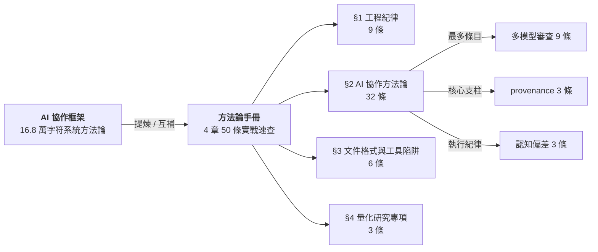

> [簡體中文](../README.md) | [English](../en/README.md) | 正體中文

# 方法論與經驗教訓手冊

**AI 協作項目全生命週期框架的精簡實戰版——50 條踩坑實證。**

版本 1.0 | 2026-07-18

> 與《AI 協作項目全生命週期框架》（16.8 萬字符）的關係類似於「教材」和「錯題本」：框架是系統方法論，手冊是把踩過的坑抽成速查條目。兩者互爲補充。原始記錄爲作者個人筆記，本手冊爲篩選整理後的公開發布版本。

---

## Methodology & Lessons Learned Handbook

**A compact, battle-tested companion to the AI Collaboration Full-Lifecycle Framework — 50 empirically-grounded lessons.**

Version 1.0 | 2026-07-18

> The relationship to the full framework (168K characters) is like "textbook" vs. "error logbook": the framework is the systematic methodology; this handbook distills the mistakes into quick-reference entries. Source material comes from the author's personal project notes, curated and published here.

---

## 目錄 / Contents

| 章節 | 條目數 | 內容 |
|------|--------|------|
| §1 通用工程紀律 | 9 | 驗證與覈實、清理與發佈、版本管理、代碼重構 |
| §2 AI 協作方法論 | 32 | 多模型審查、provenance、prompt 設計、工作流、認知偏差 |
| §3 文件格式與工具陷阱 | 6 | YAML/JSON、DOCX、文本編輯、編碼、配置文件 |
| §4 量化研究專項 | 3 | 特徵泄漏、LambdaRank、regime 檢測 |

每條含：**標題** + 一句話教訓 + 關鍵引述 + 實證日期 + 分類標籤。

---

## 分類標籤索引 / Category Tag Index

| 標籤 | 含義 | 條目數 |
|------|------|--------|
| 驗證紀律 | 下斷言/改配置/改措辭後的獨立驗證 | 3 |
| 發佈紀律 | 發佈前的清理、排除、零殘留確認 | 3 |
| 版本管理 | 版本號升級的同步範圍 | 1 |
| 代碼重構 | 從單體提取模塊的方法 | 1 |
| 工具使用 | 給外部 CLI 工具發指令的約定 | 1 |
| 多模型審查 | 多個 AI 模型做代碼/文檔審查的策略 | 9 |
| provenance | 產出物的模型來源追溯 | 3 |
| 獨立性審查 | 防止同一 AI 佔據多重角色的檢查 | 1 |
| 工具評估 | 評估 AI 代理工具的實證方法 | 2 |
| 實驗設計 | prompt 變異 vs 模型變異的效應量 | 1 |
| 任務執行 | 有計劃時的執行紀律、文本生成流程 | 2 |
| 交付物設計 | md/json 雙件的配對模式 | 1 |
| prompt 設計 | CLAUDE.md 編寫、Skill 設計協議 | 2 |
| 工作流 | 任務分派、交叉驗證、過程文件保存 | 3 |
| 上下文管理 | 大上下文壓縮的觸發時機 | 2 |
| 認知偏差 | 自評估偏樂觀、實證聲明過推廣、格式殘留盲區 | 3 |
| 協作元認知 | 對抗式審查、被動觀測、失敗重試策略 | 3 |
| 文件格式 | YAML/JSON/CFF/DOCX 格式陷阱 | 3 |
| 文本編輯 | 短模式全局替換的誤傷風險 | 1 |
| 編碼 | Windows 終端中文字符編碼 | 1 |
| 配置 | 修改配置前確認系統讀取的文件 | 1 |
| 量化研究 | 特徵泄漏、LambdaRank 敏感性、regime 滯後 | 3 |

---

## 術語說明 / Glossary

手冊中涉及特定工具或工作流概念。關注條目中的**通用原則**即可——原則獨立於具體 CLI 實現。

| 術語 | 定義 | 來源 |
|------|------|------|
| Workflow | 多 agent 編排框架，支持並行/管道式子任務分發 | Claude Code CLI |
| agent() | Workflow 中啓動子 agent 的函數 | Claude Code CLI |
| headroom_compress | 將大文本預壓縮以節省上下文窗口 | Claude Code CLI (MCP) |
| 安全分類器 / classifier | 執行命令前的安全審覈組件 | Claude Code CLI |
| Codex CLI | OpenAI 命令行 AI 編程工具 | Codex CLI |
| [GATE] | 計劃中標記爲需人工確認的阻斷點 | 項目計劃約定 |
| P0/P1/P2 | 優先級：阻塞/高/中 | 通用項目管理 |
| zero-involvement | 零捲入——審查者未參與被審查內容的創建 | 審查方法論 |
| provenance | 產出物的模型後端×會話溯源記錄 | AI 協作通用 |

完整術語表見手冊附錄。

---

## 受衆與前置 / Audience & Prerequisites

**目標讀者**：使用 AI 編程工具（Claude Code、Codex CLI、Cursor 等）進行軟件工程或學術項目的開發者與研究者。假設讀者有基本的 AI 輔助編程經驗。

**證據範圍**：手冊中的「實證」指作者在 2026 年 5-7 月間數十次 AI 協作項目中記錄的具體事件。數字（如"7/7 收斂""~11% 偏差"）來自單次觀測，適用範圍限於當時使用的模型版本和任務類型。應視爲**案例參考**而非統計結論。

手冊爲 md/json 雙件發佈。md 是真相源（先於 json 生成）。

---

## 使用方式 / How to Use

**查閱而非通讀。** 這不是教程——是速查手冊。遇到具體場景時按分類標籤定位：
- 要做代碼審查 → §2.1 多模型審查策略
- 要發佈項目 → §1.2 清理與發佈
- 配置出了問題 → §3.5 配置文件

**Browse, don't read.** This is a reference, not a tutorial. Navigate by category tags when facing specific situations.

---

## 格式 / Format

- `方法论与经验教训手册.md` — 人類可讀（含目錄、錨點鏈接、術語附錄）
- `方法论与经验教训手册.json` — 機器可讀（結構化數據，`metadata` → `sections[]` → `subsections[]` → `entries[]`）

---

---

## 相關項目 | Related Projects

| 項目 | 關係 |
|------|------|
| [**AI 協作項目全生命週期框架**](https://github.com/redamancy231-create/ai-collaboration-framework) | **上游來源** — 手冊 50 條從框架 16.8 萬字符中提煉 |
| [**Independent Review Toolkit**](https://github.com/redamancy231-create/independent-review-toolkit) | **同級工具** — 審查方法論的具體實現 |
| [**Prompt-TDD Methodology**](https://github.com/redamancy231-create/prompt-tdd-methodology) | **同級項目** — 同系列的實驗方法論案例 |
| [**DOCX Pipeline**](https://github.com/redamancy231-create/docx-pipeline) | **同級工具** — 本手冊 docx 版即由此管線生成 |
| [**claude-skills**](https://github.com/redamancy231-create/claude-skills) | **同級項目** — Skill 設計協議的經驗來源 |
| [**ETF Pattern Match (pybind11)**](https://github.com/redamancy231-create/etf-pattern-match-pybind11) | **同級項目** — 多輪審查協議實證案例 |
| [**M&A Case Study Pipeline**](https://github.com/redamancy231-create/ma-case-study-pipeline) | **同級項目** — 六層框架的另一實證案例 |

---

## 許可 / License

CC-BY-4.0

---

## 作者 / Author

[Acerolaorion](https://github.com/redamancy231-create)
